# Billing Flow Documentation

This document describes the billing system architecture and user flows for LaunchCamp's subscription management.

## Table of Contents

- [Architecture Overview](#architecture-overview)
- [Stripe Product Structure](#stripe-product-structure)
- [User Flows](#user-flows)
- [API Endpoints](#api-endpoints)
- [Key Design Decisions](#key-design-decisions)

---

## Architecture Overview

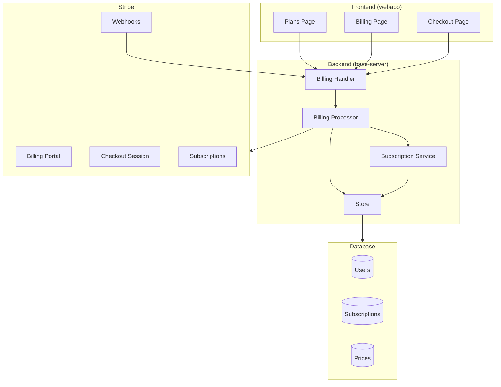

---

## Stripe Product Structure

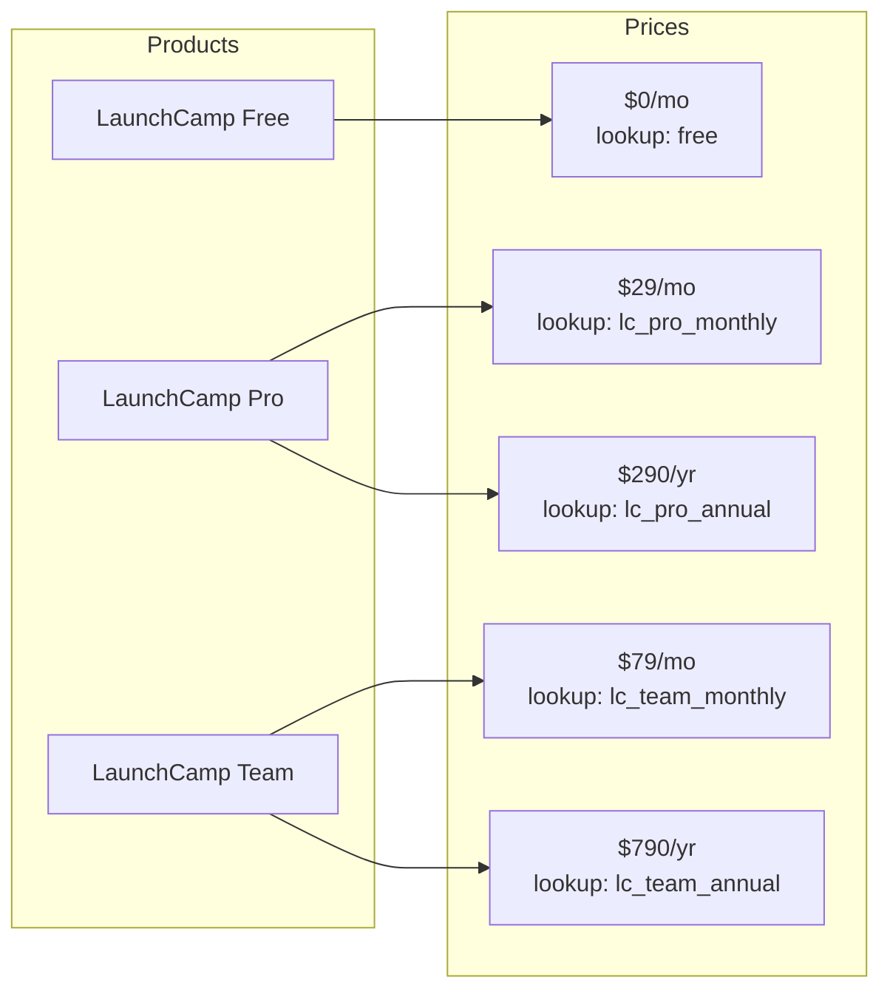

| Product | Interval | Lookup Key | Price |
|---------|----------|------------|-------|
| LaunchCamp Free | Monthly | `free` | $0/mo |
| LaunchCamp Pro | Monthly | `lc_pro_monthly` | $29/mo |
| LaunchCamp Pro | Annual | `lc_pro_annual` | $290/yr |
| LaunchCamp Team | Monthly | `lc_team_monthly` | $79/mo |
| LaunchCamp Team | Annual | `lc_team_annual` | $790/yr |

---

## User Flows

### 1. New User Signup Flow

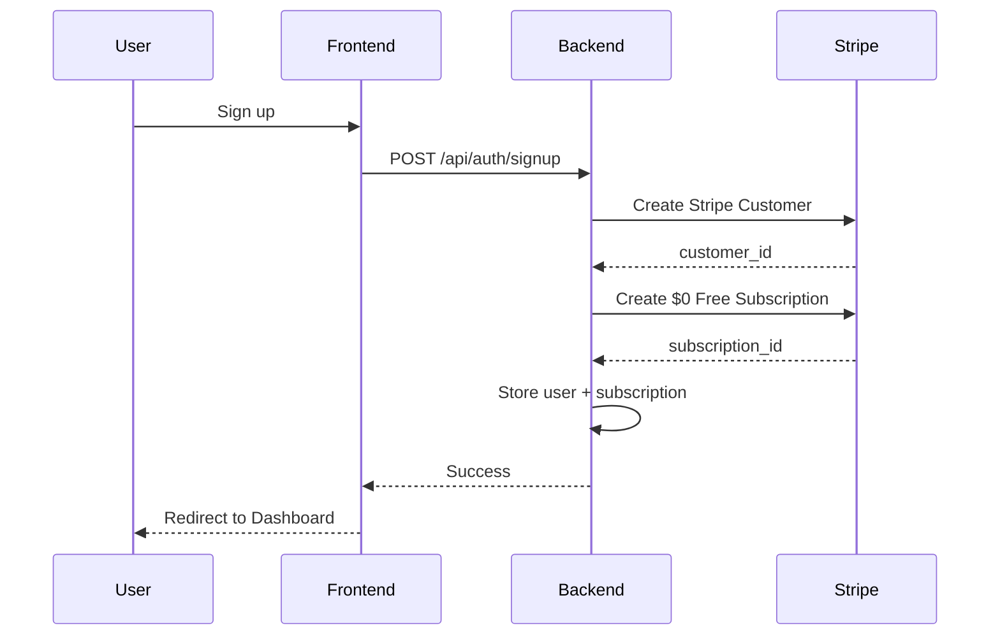

### 2. Upgrade Flow (Free → Paid)

When a user with a free subscription wants to upgrade to Pro or Team:

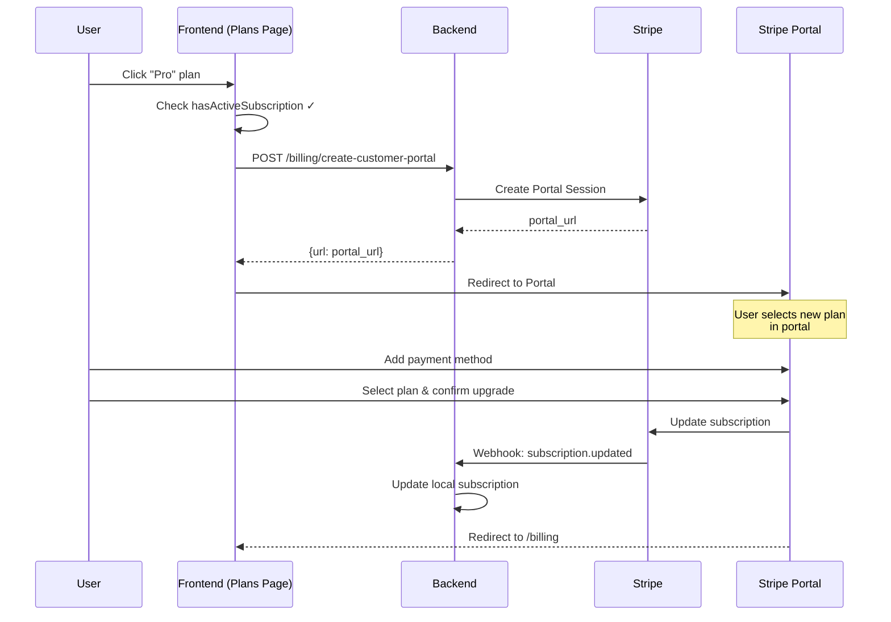

### 3. Plan Change Flow (Paid → Different Paid)

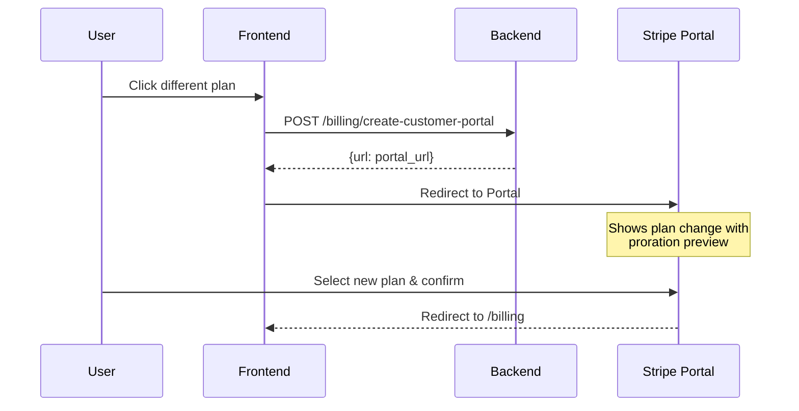

### 4. Downgrade Flow (Paid → Free)

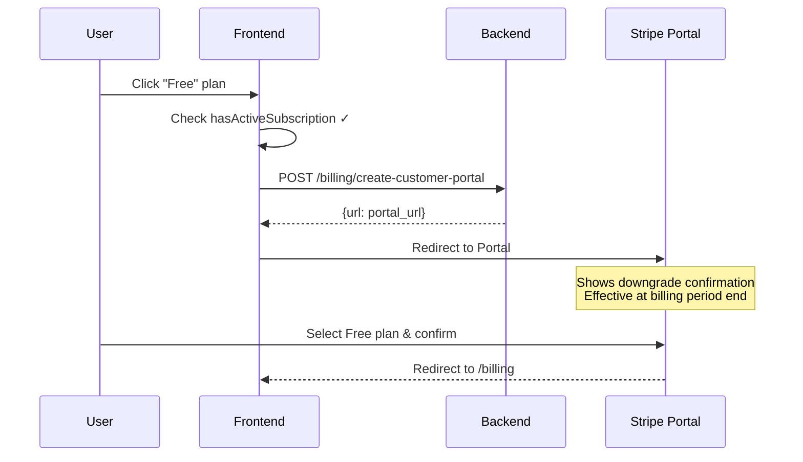

### 5. New User Selects Paid Plan (No Existing Subscription)

This flow only applies to users who somehow don't have a subscription (edge case):

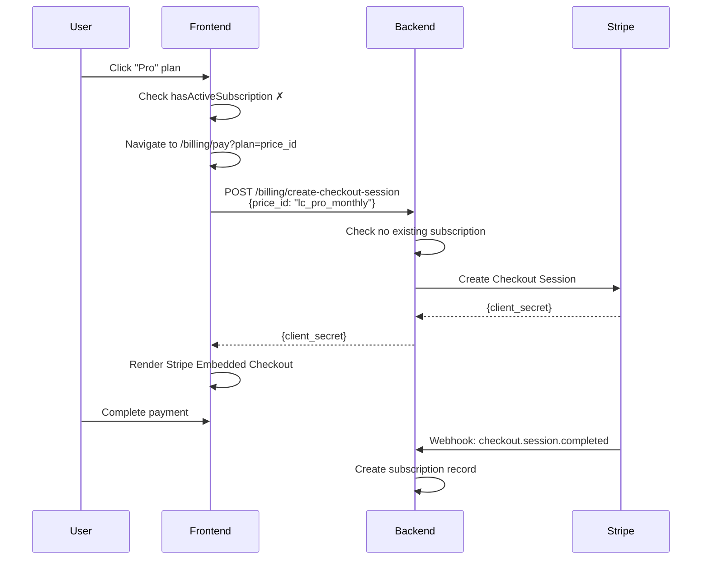

### 6. Checkout Session Prevention (Already Has Subscription)

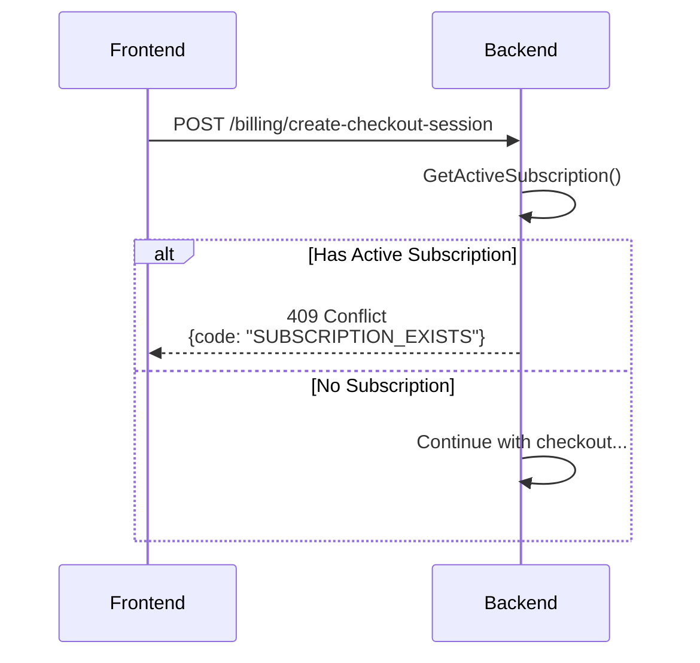

---

## API Endpoints

### Billing Endpoints

| Method | Endpoint | Description |
|--------|----------|-------------|
| `GET` | `/api/billing/plans` | Get all available prices (public) |
| `GET` | `/api/protected/billing/subscription` | Get current user's subscription |
| `POST` | `/api/protected/billing/create-checkout-session` | Create new subscription checkout |
| `POST` | `/api/protected/billing/create-customer-portal` | Get billing portal URL |
| `DELETE` | `/api/protected/billing/cancel-subscription` | Cancel subscription |

### Create Customer Portal Request

No request body required. The endpoint returns a URL to the Stripe Billing Portal where users can manage their subscription.

---

## Key Design Decisions

### 1. Single Subscription Per User

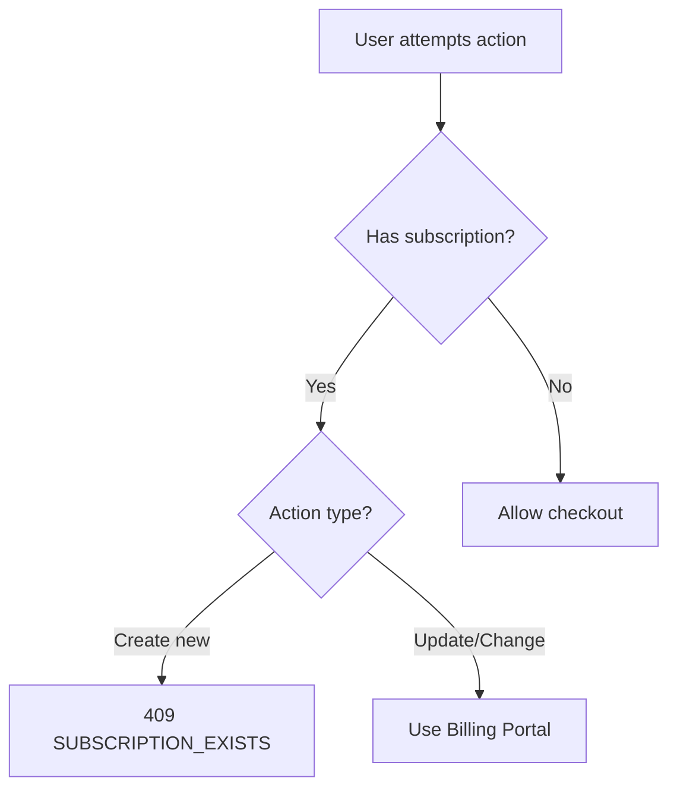

- Each user can only have ONE active subscription
- `CreateCheckoutSession` checks for existing subscription and returns 409 if found
- All plan changes go through Stripe Billing Portal

### 2. Billing Portal for All Changes

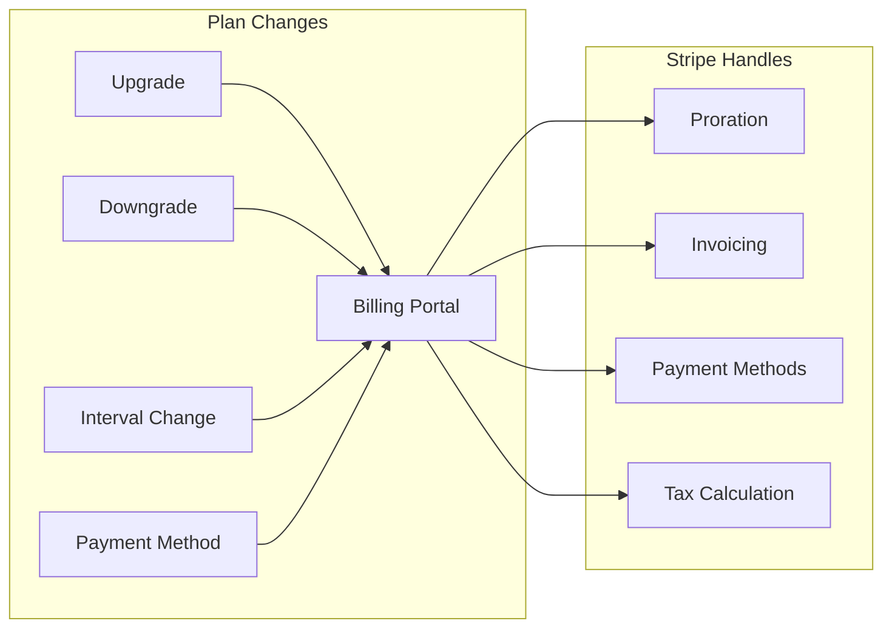

**Why Billing Portal?**
- Stripe handles proration calculations automatically
- Built-in payment method collection
- Secure card handling (PCI compliant)
- Consistent UX across all billing actions
- Less code to maintain

### 3. Portal Configuration

The billing portal uses an explicit configuration ID (`bpc_...`) that has subscription updates enabled. This ensures the correct portal configuration is used regardless of Stripe's default configuration settings.

```go
params := &stripe.BillingPortalSessionParams{
    Customer:      stripe.String(stripeCustomerID),
    ReturnURL:     stripe.String(fmt.Sprintf("%s/billing", webhostURL)),
    Configuration: stripe.String("bpc_..."), // Portal config with subscription updates enabled
}
```

### 4. Free Subscription on Signup

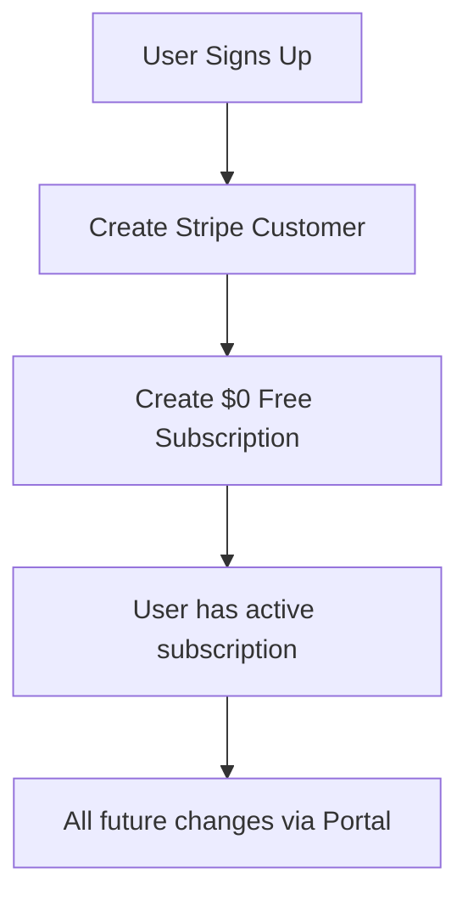

- Every user starts with a $0 subscription
- Simplifies upgrade flow (always update, never create new)
- Consistent subscription state for all users

---

## Stripe Dashboard Configuration

### Customer Portal Settings

Navigate to **Stripe Dashboard → Settings → Billing → Customer portal**:

1. **Subscriptions**
   - [x] Allow customers to switch plans
   - [x] Limit to 1 subscription
   - Add products: Free, Pro, Team

2. **Payment Methods**
   - [x] Allow customers to update payment methods

3. **Invoices**
   - [x] Show invoice history

4. **Cancellations**
   - [x] Allow customers to cancel (optional)

---

## Error Handling

| Error | HTTP Status | Code | Description |
|-------|-------------|------|-------------|
| No subscription found | 404 | - | User has no active subscription |
| Subscription exists | 409 | `SUBSCRIPTION_EXISTS` | Cannot create checkout when subscription exists |
| Failed to get subscription | 500 | - | Internal error fetching subscription |

---

## Webhook Events

The following Stripe webhooks should be configured:

| Event | Handler Action |
|-------|---------------|
| `customer.subscription.created` | Create local subscription record |
| `customer.subscription.updated` | Update local subscription (plan, status) |
| `customer.subscription.deleted` | Mark subscription as cancelled |
| `invoice.paid` | Update billing dates |
| `invoice.payment_failed` | Mark subscription as `past_due` |
